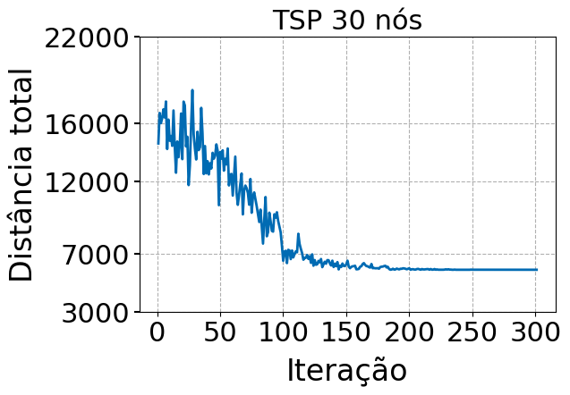

# TSP-SA
Simulated Annealing implementation for Traveling Salesman Problem 

This repository contains the implementation for both, a Simulated Anneling metaheurístic and the optimal approach to solve the Traveling Salesman Problem.

The instances used in this work, are adaptations of the instances found in this:

[https://www.math.uwaterloo.ca/tsp/world/qalog.html](https://www.math.uwaterloo.ca/tsp/world/qalog.html)

Also for the otimization model, it was considered the formulation found in the follow:

[https://math.stackexchange.com/questions/1957211/linear-programming-formulation-of-traveling-salesman-tsp-in-wikipedia](https://math.stackexchange.com/questions/1957211/linear-programming-formulation-of-traveling-salesman-tsp-in-wikipedia)

## SA Convergence
<table>
  <tr>
    <td></td>
    <td></td>
    <td></td>
  </tr>
</table>

## Comparison
<table>
  <tr>
    <td></td>
  </tr>
</table>

